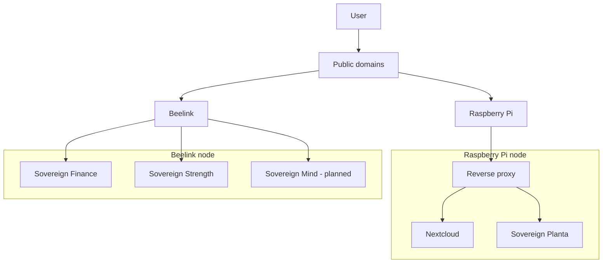

# Sovereign architecture diagram

## Overview

The diagram below shows the current high-level structure of the Sovereign ecosystem.

## Notes

- Raspberry Pi acts as the cloud-facing node.

- Beelink hosts selected application workloads.

- Sovereign Mind is currently planned but not yet implemented.

Applications remain operationally independent.
