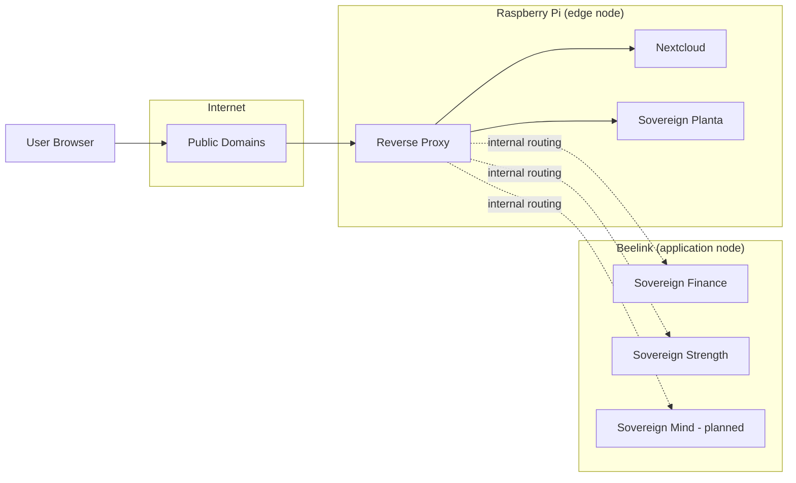

## High-level diagram

```mermaid
flowchart LR

    User[User Browser]

    subgraph Internet
        Domains[Public Domains]
    end

    subgraph Raspberry_Pi["Raspberry Pi (edge node)"]
        Proxy[Reverse Proxy]
        Nextcloud[Nextcloud]
        Planta[Sovereign Planta]
    end

    subgraph Beelink["Beelink (application node)"]
        Finance[Sovereign Finance]
        Strength[Sovereign Strength]
        Mind[Sovereign Mind - planned]
    end

    User --> Domains
    Domains --> Proxy

    Proxy --> Nextcloud
    Proxy --> Planta

    Proxy -. internal routing .-> Finance
    Proxy -. internal routing .-> Strength
    Proxy -. internal routing .-> Mind
```
